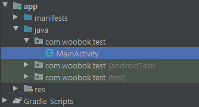
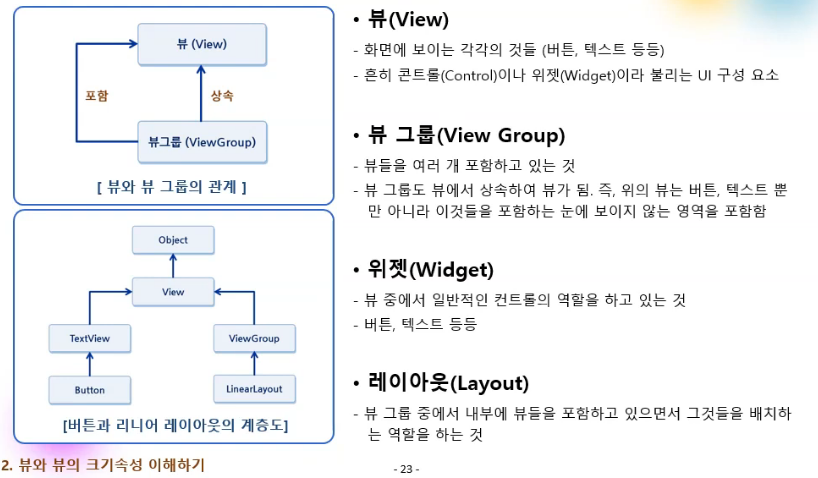
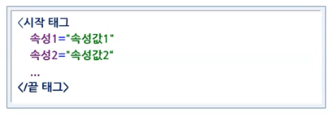
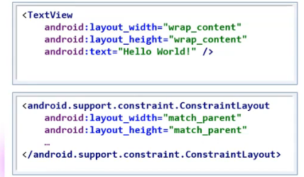
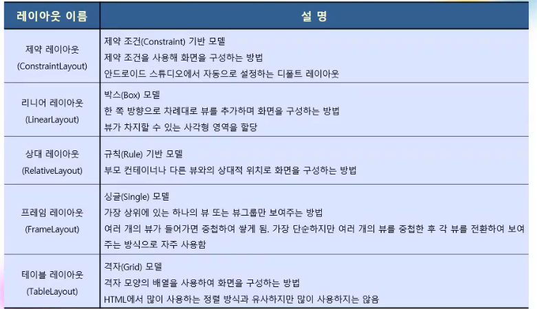

- java : 소스코드
- res : 리소스
- Grandle Scripts : 빌드 과정에서 필요한 설정 정보

## 뷰와 뷰그룹

### 뷰(View)

ConstraintLayout 뷰그룹 (뷰그룹도 뷰의 일종)

TextView 는 뷰

- 화면에 보이는 모든 것들은 뷰다
- 레이아웃도 뷰이기 때문에 레이아웃 안에 레이아웃 포함 가능

### XML 레이아웃 구성

- layout_width, layout_height
  - wrap_content : 글자수가 많아지면 그 크기를 맞춰줌
  - match_parent : 부모 레이아웃의 크기를 꽉채움 (ContraintLayout에서는 안먹힘)

ConstraintLayout

레이아웃으로 부터 얼마나 떨어져 있는지 정해서 레이아웃 구성하기

### 대표적인 레이아웃

