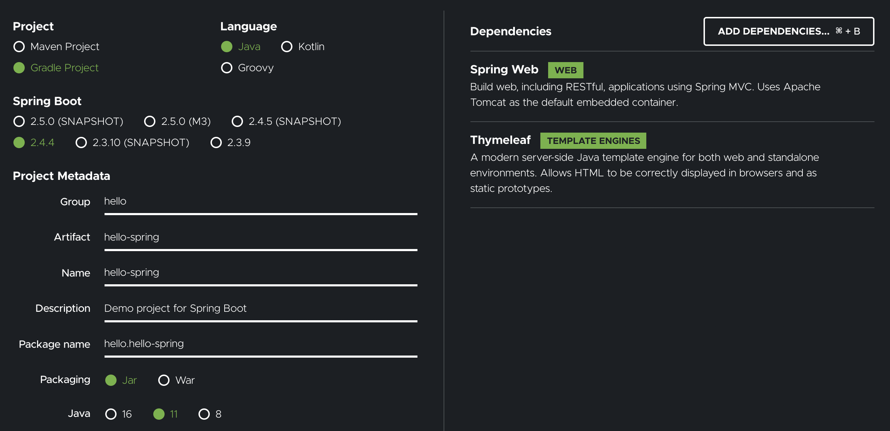
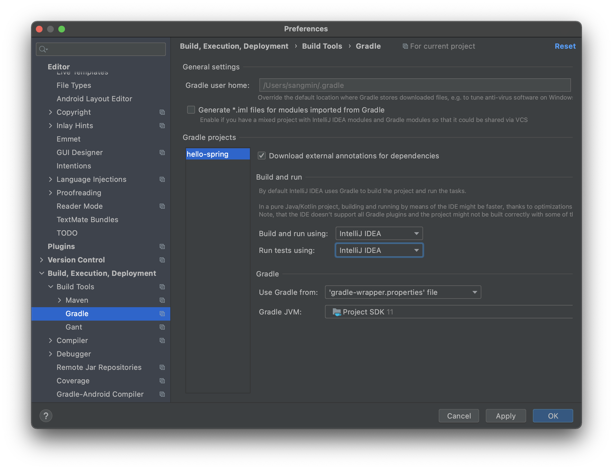
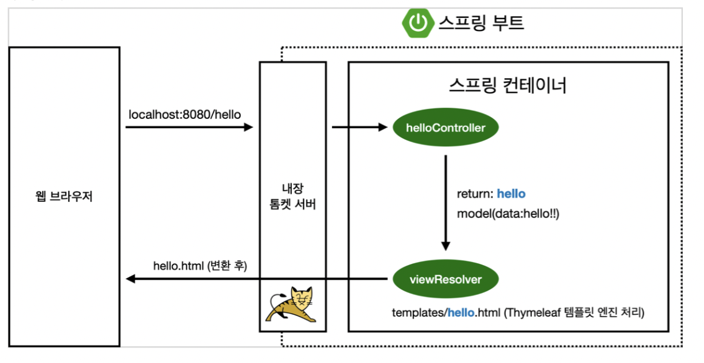

## 프로젝트 생성

> **스프링 부트 스타터 사이트로 이동해서 스프링 프로젝트 생성**
>
> https://start.spring.io

### 프로젝트 선택



- Project: `Gradle` (최근엔 Gradle 많이 사용)
- Languages: `Java`
- Spring Boot: SNAPSHOP, M123 없는 가장 최신 버전 선택
- Project Metadata
    - Group: hello
    - artifactId: hello-spring
- **Dependencies**: Spring Web, Thymeleaf (html 만들어주는 템플릿 엔진)


### build.gradle

```java
// 설정한 내역
plugins {
	id 'org.springframework.boot' version '2.4.4'
	id 'io.spring.dependency-management' version '1.0.11.RELEASE'
	id 'java'
}

// 제작하는 버전
group = 'hello'
version = '0.0.1-SNAPSHOT'
sourceCompatibility = '11'

// 공개된 사이트로부터 라이브러리 다운 받아라
repositories {
	mavenCentral()
}

// 추가한 라이브러리
dependencies {
	implementation 'org.springframework.boot:spring-boot-starter-thymeleaf'
	implementation 'org.springframework.boot:spring-boot-starter-web'
	testImplementation 'org.springframework.boot:spring-boot-starter-test'
}

test {
	useJUnitPlatform()
}

```

### build 설정 바꾸기



gradle -> IntelliJ IDEA로 바꿔야 속도가 더 빠름


## 라이브러리 살펴보기

> `External Libraries`
>
> Gradle은 의존관계가 있는 라이브러리를 함께 다운로드

Command 2번 누르면 테두리 메뉴에서 Gradle를 들어감


### **스프링 부트 라이브러리**

- spring-boot-starter-web 
    - **spring-boot-starter-tomcat: 톰캣 (웹서버)** 
    - **spring-webmvc: 스프링 웹 MVC**
- spring-boot-starter-thymeleaf: 타임리프 템플릿 엔진(View) 
- spring-boot-starter(공통): 스프링 부트 + 스프링 코어 + 로깅
    - spring-boot 
        - spring-core
    - spring-boot-starter-logging 
        - logback, slf4j

### **테스트 라이브러리**

- spring-boot-starter-test
    - junit: 테스트 프레임워크
    - mockito: 목 라이브러리
    - assertj: 테스트 코드를 좀 더 편하게 작성하게 도와주는 라이브러리 
    - spring-test: 스프링 통합 테스트 지원


## View 환경설정

### Welcome Page 만들기

> 정적 페이지

```html
<!DOCTYPE HTML>
<html>
<head>
    <title>Hello</title>
    <meta http-equiv="Content-Type" content="text/html; charset=UTF-8" />
</head>
<body>
Hello
<a href="/hello">hello</a>
</body>
</html>
```


### thymeleaf 템플릿 엔진

> 동적 페이지 가능
>
> - thymeleaf 공식 사이트: https://www.thymeleaf.org/
>
> - 스프링 공식 튜토리얼: https://spring.io/guides/gs/serving-web-content/
>
> - 스프링부트 메뉴얼: https://docs.spring.io/spring-boot/docs/2.3.1.RELEASE/reference/html/spring-boot-features.html#boot-features-spring-mvc-template-engines

`java/hello.hellospring.controller/helloController.java`

```java
package hello.hellospring.controller;

import org.springframework.stereotype.Controller;
import org.springframework.ui.Model;
import org.springframework.web.bind.annotation.GetMapping;

@Controller
public class HelloController {

    @GetMapping("hello")
    public String hello(Model model) {
        model.addAttribute("data", "hello!!");
        return "hello"; // hello.html 을 실행시켜라~
    }
}

```

`resources/templates/hello.html`

```html
<!DOCTYPE HTML>
<html xmlns:th="http://www.thymeleaf.org">
<head>
    <title>Hello</title>
    <meta http-equiv="Content-Type" content="text/html; charset=UTF-8" />
</head>
<body>
<p th:text="'안녕하세요. ' + ${data}" >안녕하세요. 손님</p>
</body>
</html>
```


### 동작 환경



컨트롤러에서 return 값으로 문자를 반환하면 viewResolver가 화면을 찾아서 처리

- 스프링 부트 템플릿엔진 기본 viewName 매핑
- `resources:templates/` + [ViewName] + `.html`


> `spring-boot-devtools` 라이브러리 추가해주면 html만 컴파일하면 서버 재시작 필요없음


## 빌드하고 실행하기

1. `./gradlew build`
2. `cd build/libs`
3. `java -jar hello-spring-0.0.1-SNAPSHOT.jar`
4. 실행확인

> 잘 안되면 `./gradlew build clean`

