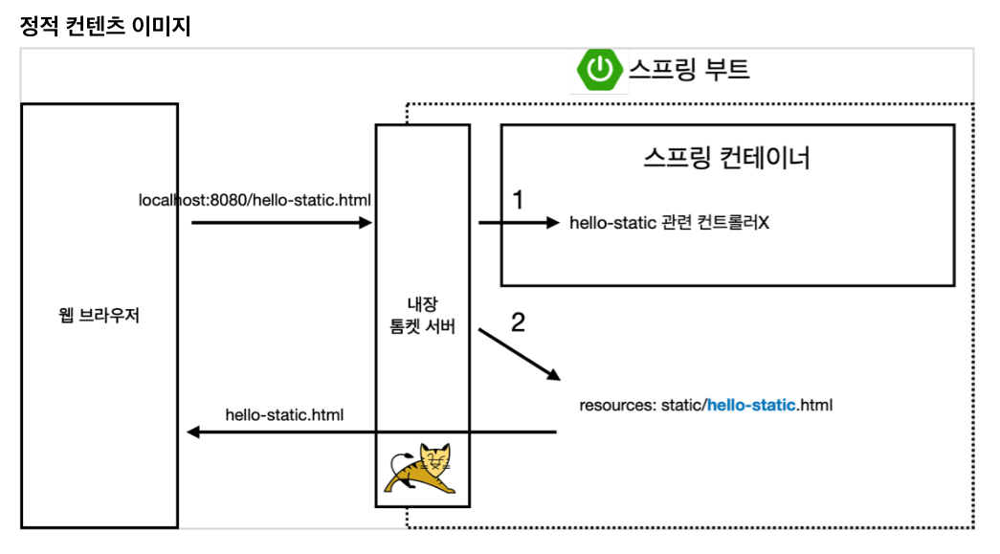
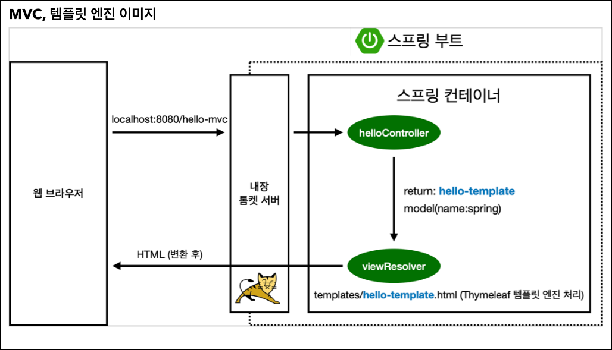
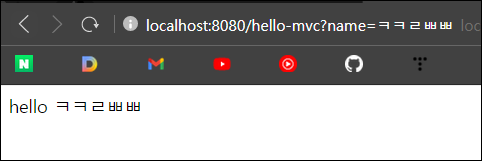
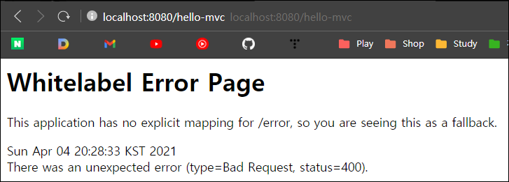
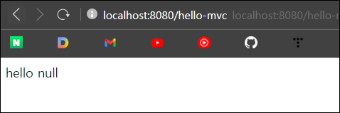
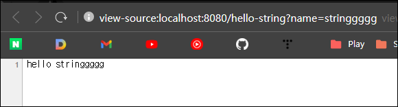
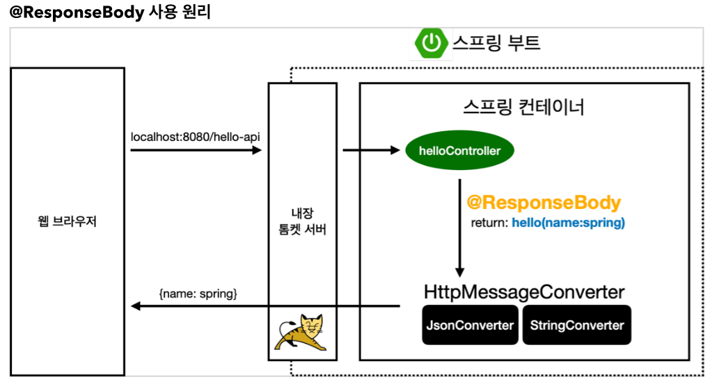
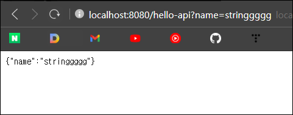

어떻게 보내줄 것인가?

1.  정적 컨텐츠
2.  동적 컨텐츠 (템플릿 엔진)
3.  API

## 정적 컨텐츠

`resources/static/hello-static.html`

```html
<!DOCTYPE HTML>
<html>
<head><title>static content</title>
    <meta http-equiv="Content-Type" content="text/html; charset=UTF-8"/>
</head>
<body> 정적 컨텐츠 입니다.</body>
</html>
```



1.  Controller 에 hello-static이 없음
2.  resources 내부에 있는 html 찾기
3.  해당 html 반환

​    

## MVC와 템플릿 엔진 (동적)

>   MVC: Model, View, Controller
>
>   -   View: 화면을 구성하는데만 집중
>   -   Model: 화면에 필요한 데이터 담은 것



### Controller 

`java/hello.hellospring.controller/helloController.java`

```java
@Controller 
public class HelloController {
    
    @GetMapping("hello-mvc") 
        public String helloMvc(@RequestParam("name") String name, Model model){
            model.addAttribute("name", name); return "hello-template";
    }
}
```


### View

`resources/template/hello-template.html`

```html
<html xmlns:th="http://www.thymeleaf.org">
<body>
<p th:text="'hello ' + ${name}">hello! empty</p>
</body>
</html>
```


### 결과



>   
>
>   Param을 안주면 위와 같이 에러발생.
>
>   `@RequestParam`은 기본값으로 `required = true` 이기 때문.
>
>   아래와 같이 추가해준다.
>
>   ```java
>   @GetMapping("hello-mvc")
>   public String helloMvc(@RequestParam(value = "name", required = false) String name, Model model){
>       model.addAttribute("name", name);
>       return "hello-template";
>   }
>   ```
>
>   

   

## API

### 문자열 return

```java
// API
@GetMapping("hello-string")
@ResponseBody   // html 의 body 부분에 리턴값을 직접 넣겠다
public String helloString(@RequestParam("name") String name) {
    return "hello " + name;
}
```


#### 결과



-   source를 봐도 html이 없고 내용만 존재함


### 객체 return



-   **`@ResponseBody`**가 있다면 Http의 Body에 직접 반환
-   `@ResponseBody`가 있으면 `viewResolver`에게 보내지 않고 `HttpMessageConverter`로 전달
-   return이 문자열일 경우 `StringHttpMessageConverter`
-   return이 json일 경우 `MappingJackson2HttpMessageConverter` 로 동작 (json 변경 라이브러리 Jackson)

```java
@GetMapping("hello-api")
@ResponseBody		// html 의 body 부분에 리턴값을 직접 넣겠다
public Hello helloApi(@RequestParam("name") String name) {
    Hello hello = new Hello();
    hello.setName(name);
    return hello;
}

static class Hello {
    private String name;

    public String getName() {
    	return name;
    }

    public void setName(String name) {
    	this.name = name;
    }
}
```

  

#### 결과



-   json 형식으로 데이터를 뿌려줌