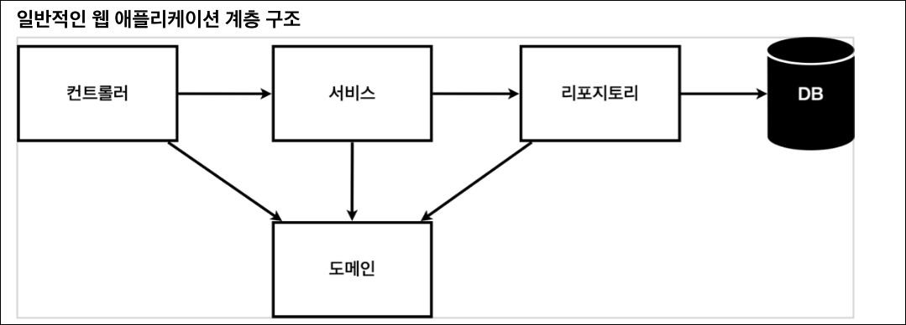
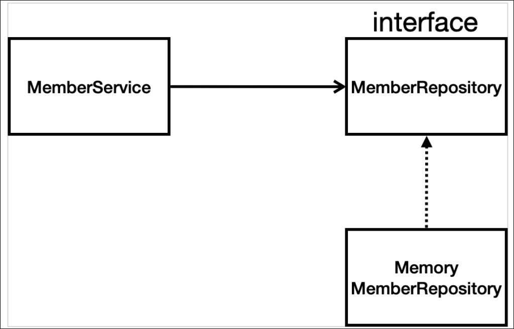
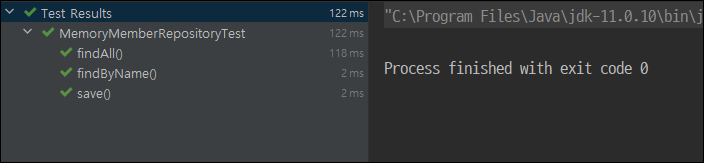

## 비즈니스 요구사항 정리

### 비즈니스 요구사항

-   데이터: 회원ID, 이름
-   기능: 회원 등록, 조회
-   아직 데이터 저장소(DB)가 선정되지 않음(가상의 시나리오)


### 일반적인 웹 어플리케이션 계층 구조



-   `Controller`: 웹 MVC의 컨트롤러 역할
-   `Service`: 핵심 비즈니스 로직 구현
-   `Repository`: DB에 접근, 도메인 객체를 DB에 저장하고 관리
-   `Domain`: (객체) 비즈니스 도메인 객체, DB에 저장하고 관리되는 객체 (ex: 회원, 주문, 쿠폰 등)


### 클래스 의존관계



-   데이터 저장소가 선정되지 않아, 우선 인터페이스로 구현 클래스 변경 가능토록 설계
-   데이터 저장소는 RDB, No SQL등 고민중인 상황
-   개발 초기 단계에서 구현체로 가벼운 메모리 기반 데이터 저장소 사용

<br>

## 회원 도메인과 repository 만들기

### 회원 객체

```java
package hello.hellospring.domain;

public class Member {
    private Long id;
    private String name;

    public Long getId() {
        return id;
    }

    public void setId(Long id) {
        this.id = id;
    }

    public String getName() {
        return name;
    }

    public void setName(String name) {
        this.name = name;
    }
}
```

### 회원 repository 인터페이스

```java
package hello.hellospring.repository;

import hello.hellospring.domain.Member;
import java.util.List; 
import java.util.Optional;

public interface MemberRepository {
    Member save(Member member); 
    Optional<Member> findById(Long id); 
    Optional<Member> findByName(String name); 
    List<Member> findAll();
}
```


### 회원 repository 메모리 구현체

```java
package hello.hellospring.repository;

import hello.hellospring.domain.Member;

import java.util.*;

public class MemoryMemberRepository implements MemberRepository{

    private static Map<Long, Member> store = new HashMap<>();
    private static long sequence = 0L; // 0, 1, 2 순서로 생성

    @Override
    public Member save(Member member) {
        member.setId(++sequence);
        store.put(member.getId(), member);
        return member;
    }

    @Override
    public Optional<Member> findById(Long id) {
        // Null 값이여도 return 가능토록
        return Optional.ofNullable(store.get(id));
    }

    @Override
    public Optional<Member> findByName(String name) {
        // lambda 활용
        return store.values().stream()
                .filter(member -> member.getName().equals(name))
                .findAny();
    }

    @Override
    public List<Member> findAll() {
        return new ArrayList<>(store.values());
    }
}
```


## 회원 repository 테스트 케이스 작성

>   -   개발한 기능을 실행해서 테스트 할 때 자바의 main 메서드를 통해서 실행하거나, 웹 애플리케이션의 컨트롤러를 통해서 해당 기능을 실행. 
>   -   이러한 방법은 준비하고 실행하는데 <u>오래 걸리고, 반복 실행하기 어렵고</u> 여러 테스트를 한번에 실행하기 어렵다는 단점
>   -   자바는 **JUnit**이라는 프레임워크로 테스트를 실행해서 이러한 문제를 해결

```java
class MemoryMemberRepositoryTest {
    MemoryMemberRepository repository = new MemoryMemberRepository();

    // 각 동작이 끝나고 호출됨
    @AfterEach
    public void afterEach(){
        repository.clearStore();
    }

    @Test
    public void save() {
        Member member = new Member();
        member.setName("spring");

        repository.save(member);

        Member result = repository.findById(member.getId()).get();
//        System.out.println("result = " + (result == member));   // 이렇게 할 수는 있지만..
//        Assertions.assertEquals(member, result);   	// 이걸로 써도 됨(다른 클래스)
        Assertions.assertThat(member).isEqualTo(result);  // 두 인자 값이 같은지 판단
    }

    @Test
    public void findByName() {
        Member member1 = new Member();
        member1.setName("spring1");
        repository.save(member1);

        Member member2 = new Member();
        member2.setName("spring2");
        repository.save(member2);

        Member result1 = repository.findByName("spring1").get();
        Assertions.assertThat(result1).isEqualTo(member1);
    }

    @Test
    public void findAll() {
        Member member1 = new Member();
        member1.setName("spring1");
        repository.save(member1);

        Member member2 = new Member();
        member2.setName("spring2");
        repository.save(member2);

        List<Member> result = repository.findAll();

        Assertions.assertThat(result.size()).isEqualTo(2);
    }
}
```



>   실행 결과가 요로코롬 이쁘게 나옴
>
>   TDD 테스트 주도 개발: 테스트 케이스 부터 만들어 놓은 후에 이에 맞춰 동작하도록 구현하는 것

<br>

## 회원 서비스 개발

```java
public class MemberService {
    private final MemberRepository memberRepository = new MemoryMemberRepository();

    /**
     * 회원 가입
     */
    public Long join(Member member) {
//        같은 이름이 있는 중복 회원 X
//        ifPresent: Null 이 아니면 동작
        validateDuplicateMember(member);
        memberRepository.save(member);
        return member.getId();
    }

//    Ctrl Alt M 메서드로 만들어내기
    private void validateDuplicateMember(Member member) {
        memberRepository.findByName(member.getName())
                .ifPresent(m -> {
                    throw new IllegalStateException("이미 존재하는 회원입니다.");
                });
    }

    /**
     * 전체 회원 조회
     */
    public List<Member> findMembers(){
        return memberRepository.findAll();
    }

    public Optional<Member> findOne(Long memberId) {
        return memberRepository.findById(memberId);
    }
}

```

<br>

## 회원 서비스 테스트

>   테스트할 클래스에서 `Ctrl Shift T` 클릭하면 Test 클래스를 알아서 만들어줌

>   테스트할 때 아래의 규칙에 맞춰서 하자
>
>   ```java
>   //        given: 주어진 상황에서 (데이터)
>           
>   //        when: 무엇을 실행할 때 (무엇을 테스트?)
>   
>   //        then: 이렇게 되도록 (검증)
>   ```

### 예외 테스트

```java
    @Test
    public void 중복_회원_예외() {
//        given
        Member member1 = new Member();
        member1.setName("spring");

        Member member2 = new Member();
        member2.setName("spring");

//        when
        memberService.join(member1);
        try{
            memberService.join(member2);    // 중복 회원 발생
            fail(); // 이게 실행되면 fail
        } catch (IllegalStateException e ){
            assertThat(e.getMessage()).isEqualTo("이미 존재하는 회원입니다.");
        }
    }
```

-   이런식으로 할 수 있지만 코드가 길어지고 가독성이 떨어짐

```java
    @Test
    public void 중복_회원_예외() {
//        given
        Member member1 = new Member();
        member1.setName("spring");

        Member member2 = new Member();
        member2.setName("spring");

//        when
        memberService.join(member1);
        // 실행될 때 이 예외가 터져야 정상이다!
        assertThrows(IllegalStateException.class, () -> memberService.join(member2));
        assertThat(e.getMessage()).isEqualTo("이미 존재하는 회원입니다.");
	}
```


### 실행 마다

>   DI 적용

```java
    @BeforeEach
    public void beforeEach() {
        memberRepository = new MemoryMemberRepository()
        memberService = new MemberService(memberRepository);
    }

	@AfterEach
    public void afterEach(){
        memberRepository.clearStore();
    }
 
```

