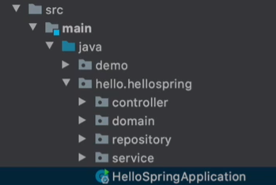

### Spring Bean 을 등록하는 2가지 방법

1.  컴포넌트(`@Component`) 스캔과 자동 의존 관계 설정
2.  자바 코드로 직접 스프링 빈 등록하기

## 컴포넌트 스캔과 자동 의존관계 설정 

>    `MemberController`가 `MemberService`와 `MemberRepository`를 사용할 수 있게 의존관계 설정

### @Controller

-   스프링 컨테이너가 생기는데 `MemberController`객체 생성을 해서 스프링 컨테이너에 넣음
-   그것이 Spring Bean
-   기본으로 싱글톤으로 등록(유일하게 하나만 등록해서 공유). (변경가능)

<br>

### 1. New 를 사용한다면?

```java
@Controller
public class MemberController {

    private final MemberService memberService = new MemberService();
}
```

-   이런 식으로 하면 다른 컨트롤러에서 memberService가 필요할 때 또 생성하면 다른 객체이기 때문
-   따라서 스프링 컨테이너에 한번 등록해서 같이 쓰기


### 2. Autowired?

```java
@Controller
public class MemberController {

    private final MemberService memberService;

    @Autowired
    public MemberController(MemberService memberService) {
        this.memberService = memberService;
    }
}
```

-   `@Autowired`는 스프링 컨테이너로 부터 `memberService`를 자동으로 연결시켜줌
-   `MemberService`를 자동으로 연결 시켜주기 위해 아래와 같은 Annotation 추가 필요

```java
@Service
public class MemberService {
    ...
}
```

-   `MemoryMemberRepository`도 마찬가지

```java
@Repository
public class MemoryMemberRepository implements MemberRepository{
	...
}
```

>   이렇게 `@Autowired`된 객체를 넣어서 직접 생성하지 않는 방식이 Dependency Injection (DI)
>
>   `@Controller`, `@Service`, `@Repository`는 `@Component`를 포함해서 작동함

<br>

>   
>
>   -   `@Component`, `@Controller`, `@Service`, `@Repository`는 스프링 컨테이너에 스프링 빈 객체 등록
>
>   -   `@Autowired`는 이어주는 화살표 역할
>
>       >   
>       >
>       >   `HelloSpringApplication`이 존재하는 `hello.hellospring`패키지까지는 Annotation으로 찾지만 demo는 Annotation 있어도 작동 안함

<br>

## 자바 코드로 직접 스프링 빈 등록하기

-   장점: 정형화 되지 않은 상황에 코드 변경 최소화 하여 바꿀 수 있음
    -   `return new MemoryMemberRepository();`
    -   -> `return new DBMemberRepository();`
    -   config에서 이렇게만 바꾸면 끝

>   `@Component` Annotation 제거하고 진행

```java
// 설정 Annotation 읽어 들임
@Configuration
public class SpringConfig {

    // 컨테이너에 등록
    @Bean
    public MemberService memberService(){
        return new MemberService(memberRepository());
    }

    @Bean
    public MemberRepository memberRepository(){
        return new MemoryMemberRepository();
    }
}

```

-   과거에는 XML로 했지만 최근에는 잘 사용하지 않음
-   DI 주입 방법에는 생성자, setter, 필드 주입이 있지만, setter는 public으로 해야되서 생성자 주입을 주로 씀
-   주로 컴포넌트 스캔 사용하며 <u>정형화 되지 않은 상황에 config 이용</u>해 스프링 빈으로 등록

