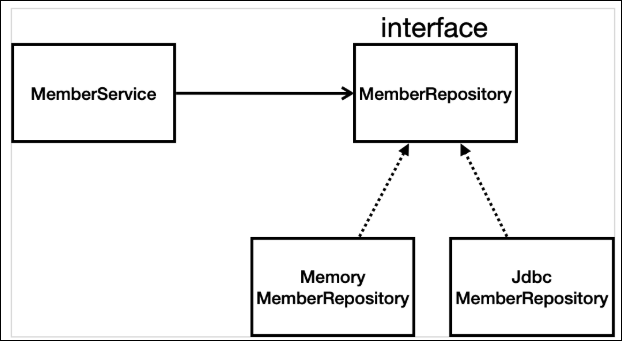
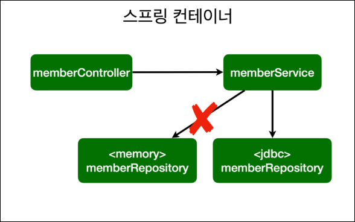
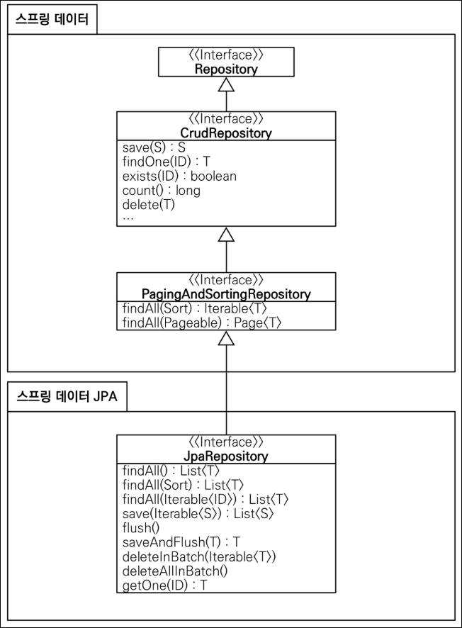

>   DB와 통신하는 단계를 업그레이드 하며 배워보자
>
>   1.  순수 JDBC
>   2.  스프링 JdbcTemplate
>   3.  JPA
>   4.  스프링 데이터 JPA

## H2 데이터베이스

### H2 설치

-   다운로드 [링크](http://h2database.com/html/main.html)
-   리눅스 계열인 경우
    -   권한 주기: `chmod 755 h2.sh`
    -   실행: `./h2.sh`
-   윈도우 계열인 경우
    -   실행: `./h2.bat`
-   JDBC URL 설정
    -   최초 한번은 `jdbc:h2:~/Desktop/Sangmin/Project/TIL/Back-end/db/test`로 하기
    -   이후, `jdbc:h2:tcp://localhost/~/Desktop/Sangmin/Project/TIL/Back-end/db/test`로 접속

### H2 설정

-   `member` 테이블 생성

    ```sql
    create table member 
    (
        id bigint generated by default as identity, 
        name varchar(255),
        primary key (id)
    );
    ```

    >   -   Java의 Long = SQL의 bigint
    >   -   `generated by default as identity`는 Null 값 들어오면 자동으로 설정

<br>

## 1. 순수 JDBC (요즘 안씀)

### JDBC 설정

-   `build.gradle` 파일에 jdbc, h2 관련 라이브러리 추가

    ```java
    dependencies {
    	implementation 'org.springframework.boot:spring-boot-starter-thymeleaf'
    	implementation 'org.springframework.boot:spring-boot-starter-web'
    	testImplementation 'org.springframework.boot:spring-boot-starter-test'
    
    	implementation 'org.springframework.boot:spring-boot-starter-jdbc'
    	runtimeOnly 'com.h2database:h2'
    }
    ```

-   Spring boot DB 연결 설정 (`resources/application.properties`)

    ```ini
    spring.output.ansi.enabled=always
    spring.datasource.url=jdbc:h2:tcp://localhost/~/Desktop/Sangmin/Project/TIL/Back-end/db/test
    spring.datasource.driver-class-name=org.h2.Driver
    spring.datasource.username=sa
    ```

-   JDBC repository 구현 (`repository/JdbcMemberRepository.java`)

-   **스프링 설정 변경**

    ```java
    @Configuration
    public class SpringConfig {
    
        private final DataSource dataSource;
    
        @Autowired
        public SpringConfig(DataSource dataSource) {
            this.dataSource = dataSource;
        }
    
        @Bean
        public MemberService memberService(){
            return new MemberService(memberRepository());
        }
    
        @Bean
        public MemberRepository memberRepository(){
    //        return new MemoryMemberRepository();
            return new JdbcMemberRepository(dataSource);
        }
    }
    
    ```

### 구현 클래스 이미지



### 스프링 설정 이미지



-   **개방-폐쇄 원칙**(OCP, Open-Closed Principle): 확장에는 열려있고, 수정-변경에는 닫혀있음
-   스프링의 **DI(Dependencies Injection)을 활용**하여 기존 코드를 수정하지 않고 설정 변경으로 구현 클래스 변경
-   데이터를 DB에 저장하므로 스프링 서버를 다시 실행해도 데이터가 안전하게 저장

<br>

## 스프링 통합 테스트

>   이전까지 했던 테스트는 DB 연결 등 스프링 통합 테스트가 아닌 자바코드로 동작하는 단위테스트일 뿐.
>
>   이번엔 통합 테스트를 진행
>
>   단위테스트도 필요! 속도가 매우 빠름, 상세한 테스트 가능

### 통합 테스트  설정

-   `test/service/MemberServiceIntegrationTest.java`

-   Service, Repository를 스프링 컨테이너로부터 주입받기

    ```java
    @SpringBootTest
    @Transactional
    class MemberServiceIntegrationTest {
        // 스프링 컨테이너에게 Service, Repository 내놔!
        // 테스트는 가장 마지막에 하는 것이므로 Constructor 없이 Autowired 로 바로 DI 해도됨
        @Autowired MemberService memberService;
        @Autowired MemberRepository memberRepository;
    	
    	...
    }
    ```

-   `@Autowired` 덕택에 `@BeforeEach`가 필요없음 (Service, Repository 주입)

-   `@Transactional` 덕택에 `@AfterEach`가 필요없음 (DB 초기화)

    -   테스트 시작 전에 트랜잭션을 시작하고 테스트 완료 후에 항상 **롤백**
    -   DB에 데이터가 남지 않으므로 다음 테스트에 영향을 주지 않음

<br>

## 2. 스프링 JdbcTemplate

>   -   dependency는 순수 JDBC 설정과 동일
>   -   스프링 JdbcTemplate과 MyBatis 같은 라이브러리는 JDBC API에서 본 반복 코드를 대부분 제거
>   -   하지만 SQL은 직접 작성

### JdbcTemplate repository

-   `JdbcTemplateMemberRepository.java`

    ```java
    public class JdbcTemplateMemberRepository implements MemberRepository {
    
        private final JdbcTemplate jdbcTemplate;
    
    //    생성자가 1개면 @Autowired 생략 가능
    //    @Autowired
        public JdbcTemplateMemberRepository(DataSource dataSource) {
            this.jdbcTemplate = new JdbcTemplate(dataSource);
        }
    
        @Override
        public Member save(Member member) {
    //        삽입 전용 클래스
            SimpleJdbcInsert jdbcInsert = new SimpleJdbcInsert(jdbcTemplate);
    //        삽입할 테이블과 key 설정
            jdbcInsert.withTableName("member").usingGeneratedKeyColumns("id");
    
    //        삽입할 데이터 생성
            Map<String, Object> parameters = new HashMap<>();
            parameters.put("name", member.getName());
    
    //        삽입 수행 (key 값 반환)
            Number key = jdbcInsert.executeAndReturnKey(new MapSqlParameterSource(parameters));
            member.setId(key.longValue());
    
            return member;
        }
    
        @Override
        public Optional<Member> findById(Long id) {
            List<Member> result = jdbcTemplate.query("select * from member where id = ?", memberRowMapper(), id);
            return result.stream().findAny();
        }
    
        @Override
        public Optional<Member> findByName(String name) {
            List<Member> result = jdbcTemplate.query("select * from member where name = ?", memberRowMapper(), name);
            return result.stream().findAny();
        }
    
        @Override
        public List<Member> findAll() {
            return jdbcTemplate.query("select * from member", memberRowMapper());
        }
    
    // 쿼리 결과(rs)와 Member 클래스를 매핑시켜줌    
        private RowMapper<Member> memberRowMapper(){
            return (rs, rowNum) -> {
                Member member = new Member();
                member.setId(rs.getLong("id"));
                member.setName(rs.getString("name"));
                return member;
            };
        }
    }
    
    ```

    

<br>

## 3. JPA

>   -   JPA는 기존의 반복 코드는 물론이고, **기본적인 SQL도 JPA가 직접 만들어서 실행**
>   -   JPA를 사용하면, SQL과 데이터 중심의 설계에서 객체 중심의 설계로 패러다임을 전환
>   -   JPA를 사용하면 개발 생산성을 크게 높임

### JPA 설정

-   `build.gradle` dependency 추가

    ```java
    dependencies {
    	implementation 'org.springframework.boot:spring-boot-starter-thymeleaf'
    	implementation 'org.springframework.boot:spring-boot-starter-web'
    	testImplementation 'org.springframework.boot:spring-boot-starter-test'
    
    //	implementation 'org.springframework.boot:spring-boot-starter-jdbc'    
    	implementation 'org.springframework.boot:spring-boot-starter-data-jpa'
    	runtimeOnly 'com.h2database:h2'
    }
    ```

    >   `spring-boot-starter-data-jpa`가 `spring-boot-starter-jdbc`를 포함하고 있기 때문에 없앰

-   `application.properties` 설정

    ```ini
    spring.output.ansi.enabled=always
    spring.datasource.url=jdbc:h2:tcp://localhost/~/Desktop/Sangmin/Project/TIL/Back-end/db/test
    spring.datasource.driver-class-name=org.h2.Driver
    spring.datasource.username=sa
    
    # JPA 가 날리는 sql 볼 수 있음
    spring.jpa.show-sql=true
    # 자동 테이블 생성 기능 끔 (create 면 킴)
    spring.jpa.hibernate.ddl-auto=none
    ```

-   JPA Entity Mapping 을 위한 `Member.java` 변경

    ```java
    // 객체와 DB를 JPA 를 통해 매핑
    @Entity
    public class Member {
    
    //    @Id: key 값임을 나타냄
    //    @GeneratedValue(strategy = GenerationType.IDENTITY): DB가 자동으로 생성해줌
        @Id @GeneratedValue(strategy = GenerationType.IDENTITY)
        private Long id;
    
    //    @Column: 클래스 field 명과 db field 명이 다른 경우
    //    @Column(name = "username")
        private String name;
    	...
    }
    ```

-   Service `@Transactional` 추가 (데이터  변경 작업이 일어나면 반드시 필요함)

    >   -   스프링은 해당 클래스의 메서드를 실행할 때 트랜잭션 시작, 메서드가 정상 종료되면 트랜잭션 커밋
    >   -   만약 런타임 예외가 발생하면 롤백
    >   -   JPA를 통한 모든 데이터 변경은 트랜잭션 안에서 실행

    ```java
    @Transactional
    public class MemberService {
        ...
    }
    ```

    

### JPA Repository

-   `JpaMemberRepository.java`

    ```java
    public class JpaMemberRepository implements MemberRepository{
    
        private final EntityManager em;
    
        public JpaMemberRepository(EntityManager em) {
            this.em = em;
        }
    
        @Override
        public Member save(Member member) {
            em.persist(member);
    //        member 에 저장된 rs의 id도 넣어짐
            return member;
        }
    
        @Override
        public Optional<Member> findById(Long id) {
            Member member = em.find(Member.class, id);
            return Optional.ofNullable(member);
        }
    
        @Override
        public Optional<Member> findByName(String name) {
            List<Member> result = em.createQuery("select m from Member m where m.name = :name", Member.class)
                    .setParameter("name", name)
                    .getResultList();
            return result.stream().findAny();
        }
    
        @Override
        public List<Member> findAll() {
    //        객체(Entity)를 대상으로 쿼리를 날림
    //        Member as m 에서 as 생략 가능
            return em.createQuery("select m from Member m", Member.class).getResultList();
        }
    }
    
    ```


### 스프링 설정 변경

-   `SpringConfig`

    ```java
    @Configuration
    public class SpringConfig {
        private final DataSource dataSource;
        private final EntityManager em;
    
        @Autowired
        public SpringConfig(DataSource dataSource, EntityManager entityManager) {
            this.dataSource = dataSource;
            this.em = entityManager;
        }
    
    
        @Bean
        public MemberService memberService() {
            return new MemberService(memberRepository());
        }
    
        @Bean
        public MemberRepository memberRepository() {
    //        return new MemoryMemberRepository();
    //        return new JdbcMemberRepository(dataSource);
    //        return new JdbcTemplateMemberRepository(dataSource);
            return new JpaMemberRepository(em);
        }
    }
    ```

    


<br>

## 4. 스프링 데이터 JPA

>   -   스프링부트, JPA만 사용해도 개발 생산성이 많이 증가하지만
>   -   스프링 데이터 JPA 사용시, repository 구현 클래스 없이 인터페이스만으로 개발 완료
>   -   CRUD 기능 제공

### 스프링 데이터 JPA repository

-   `SpringDataJpaMemberRepository.java` (interface임)

    ```java
    public interface SpringDataJpaMemberRepository extends JpaRepository<Member, Long>, MemberRepository {
    
        @Override
        Optional<Member> findByName(String name);
    }
    // 이게 끝임
    ```

-   스프링 데이터 JPA 인터페이스만 만들어 놓고 **JpaRepository 상속 받으면, 인터페이스에 대한 구현체를 알아서 만들고 스프링 컨테이너에 등록**함.

### 스프링 설정 변경

-   `SpringConfig.java`

    ```java
    @Configuration
    public class SpringConfig {
    //    private final DataSource dataSource;
    //    private final EntityManager em;
    //
    //    @Autowired
    //    public SpringConfig(DataSource dataSource, EntityManager entityManager) {
    //        this.dataSource = dataSource;
    //        this.em = entityManager;
    //    }
    
        private  final MemberRepository memberRepository;
    
        @Autowired
        public SpringConfig(MemberRepository memberRepository) {
            this.memberRepository = memberRepository;
        }
    
        @Bean
        public MemberService memberService() {
            return new MemberService(this.memberRepository);
        }
    
    //    @Bean
    //    public MemberRepository memberRepository() {
    //        return new MemoryMemberRepository();
    //        return new JdbcMemberRepository(dataSource);
    //        return new JdbcTemplateMemberRepository(dataSource);
    //        return new JpaMemberRepository(em);
    //    }
    }
    ```

### 동작방식



-   제공 기능
    -   인터페이스를 통한 기본적인 CRUD
    -   즉, 인터페이스의 함수명으로 기능가능
    -   `findByName()`, `findByEmail()` 처럼 메서드 이름만으로 조회 기능 제공 (규칙이 있음!)
        -   `findByXXX()`로 하면 알아서 `select m from Member m where m.XXX = ?`로 실행
    -   페이징 기능 자동 제공

