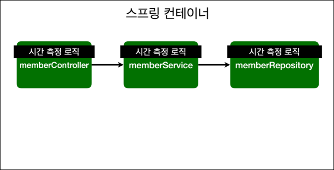
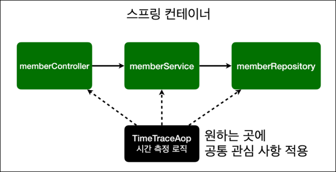
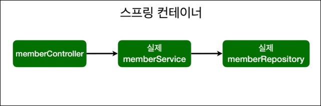
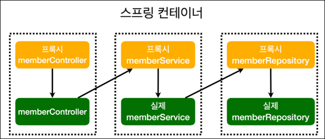

## AOP가 필요한 상황

### 필요한 상황?

-   모든 메서드의 호출 시간을 측정하고 싶다면?

    ```java
        public Long join(Member member) {
            long start = System.currentTimeMillis();
    
            try {
    //        같은 이름이 있는 중복 회원 X
    //        ifPresent: Null 이 아니면 동작
                validateDuplicateMember(member);
                memberRepository.save(member);
                return member.getId();
            } finally {
                long finish = System.currentTimeMillis();
                System.out.println("join = " + (finish - start) + "ms");
            }
        }
    // 이런 걸 모든 메서드에 적용하긴 좀 그렇잖어~~~
    ```

-   공통 관심 사항(cross-cutting concern) vs 핵심 관심 사항(core concern)     **나눌수 없을끼?**

-   회원 가입 시간, 회원 조회 시간을 측정하고 싶다면?

### AOP 사용안하면 문제점

-   회원가입, 회원 조회 시간 측정 기능은 **핵심 기능**이 아님
-   시간 측정 로직은 공통 관심 사항.
-   시간 측정 로직과 핵심 비즈니스 로직이 섞여 유지보수 어려움
-   시간 측정 로직을 별도의 공통 로직으로 만들기 어려움
-   시간 측정 로직 변경시 모든 로직 찾아가며 변경해야함

<br>

## AOP 적용

>   적용 전 ->  
>
>   ---
>
>   적용 후  -> 

-   **AOP:** Aspect Oriented Programming 관점지향프로그래밍
-   **공통관심사항과 핵심관심사항의 분리**

### 시간 측정 AOP 등록

-   `TimeTraceAop.java`

    ```java
    // Aspect 가 있어야 Aop
    @Aspect
    // Component 로 등록해도 되지만, SpringConfig 에 등록하는게 좋음
    @Component
    public class TimeTraceAop {
    
        @Around("execution(* hello.hellospring..*(..))")
        public Object execute(ProceedingJoinPoint joinPoint) throws Throwable {
            long start = System.currentTimeMillis();
    
            System.out.println("START: " + joinPoint.toShortString());
            try {
                return joinPoint.proceed();
            } finally {
                long finish = System.currentTimeMillis();
                long timeMs = finish - start;
                System.out.println("END: " + joinPoint.toShortString() + " " + timeMs + "ms");
            }
        }
    }
    
    ```

### 장점

-   핵심 관심사항과 공통 관심 사항을 분리
-   시간 측정 로직을 별도의 공통 로직으로 만듬
-   핵심 관심 사항 깔끔 유지
-   변경 시 이 로직만 변경하면 댐
-   원하는 적용 대상 선택가능


### 스프링의 AOP 동작 방식 설명

-   적용 전

    

-   적용 후

    

-   가짜 스프링 빈(프록시)를 만들어 두고 `joinPoint.proceed()`가 수행될 때 진짜 스프링 빈이 실행

>   콘솔로 확인한 결과
>
>   `System.out.println("memberService = " + memberService.getClass());`
>
>   